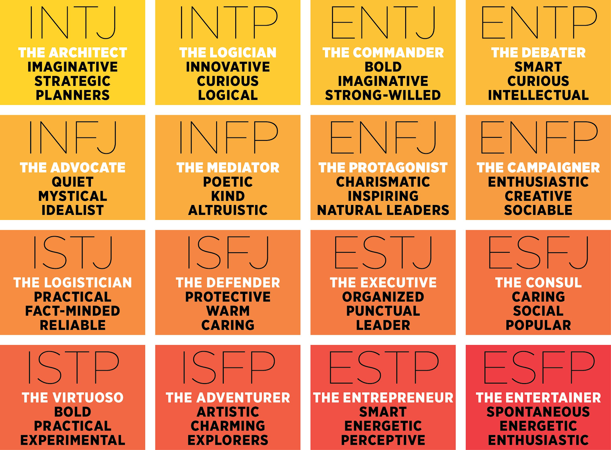

# Personality-Prediction-Through-NLP

## Scope and Overview
  Can personality be predicted through Natural Language Processing (NLP)? This project endeavored to test the reliability of machine Learning (ML) models in cataloging and predicting Myers-Briggs (MB) personality types aacording to text.
    - The information used in this project was sourced from www.personalitycafe.com, a MB personality forum. 
    - The users sourced made their MB pesonalities public
    - 8,675 users populated the database. 
    - The last 50 posts were collected for each user to constitute the available NLP text. 

Based on Carl Jung's suppositions of the psyche, the MB personality classification system is largely discredited as a pseudoscience and concerns have been raised about conflicts of interest in the legitiamcy of research. However, it does overlap in some character trait identficiation metrics with the scientifically validated 'Big Five' (such as extroversion/introversion). What the MB system explicitly has going for it is its established popularity and ease of access, making it much more prolific in accessing data. 
In the MB system, there are four bimodal classifiers resulting in 16 distinct classifications. The 16 personalities are:

## Personality Distribution
  A dramatic disparity was observed between the personality distributions of the population and those found on PersonalityCafe (source https://www.careerplanner.com/MB2/TypeInPopulation.cfm). For example, while the four personalities ESTP, ESTJ, ESFP, ESFJ constitute 33.8% in the global population, only 2.5% was represented in the data.
### Global Population Distrbibution of MB Personalities

### DataSet Distribution of MB Personalities

### DataSet Distribution of Four Basic Classifiers 

## ML Model Accuracy 
  Classification ML models were run to test the accuracy of prediction for each MB Personality type. Random chance would suggest a 6.25% predicitive success rate. A Multinomial Naive Bayes model performed at 21.1% and a Random Forest (RF) model performed at 26.9% accuracy. Although a dramatic improvement (over 4x the predicitve power), the models were deemed incapable of differntiating between 16 distinct classifications. 
   Bernoulli Naive Bayes (BNB) , Random Forest (RF) , and Gradient Boosted Random Forest (GBRF) models were trained and juxtaposed in their performance. 

Personality Characteristic | Bernoulli NB | Random Forest | Gradient Boosted RF
---------------------|------------|------------|----------------|
Introvert | 76.988% | 76.950% | 74.914%
Sensing | 88.091% | 86.208% | 81.100%
Thinking | 86.055% | 69.804% | 73.185%
Perceiving | 63.043% | 60.738% | 61.544%

## Conclusion
  The BNB model outperformed the others in all binary classifications, with a top accuracy of 88%. However, this closely approximates the actual distribution of the traits, so the model may have learned to simply classify by guessing. 
  Word clouds were created from the text vectorization for each primary personality classifier to illustrate the top 20 most important words used by a personality subclass. 

### Judging/Perceiving

### Extrovert/Introvert

### Intuitive/Sensing

### Feeling/Thinking

